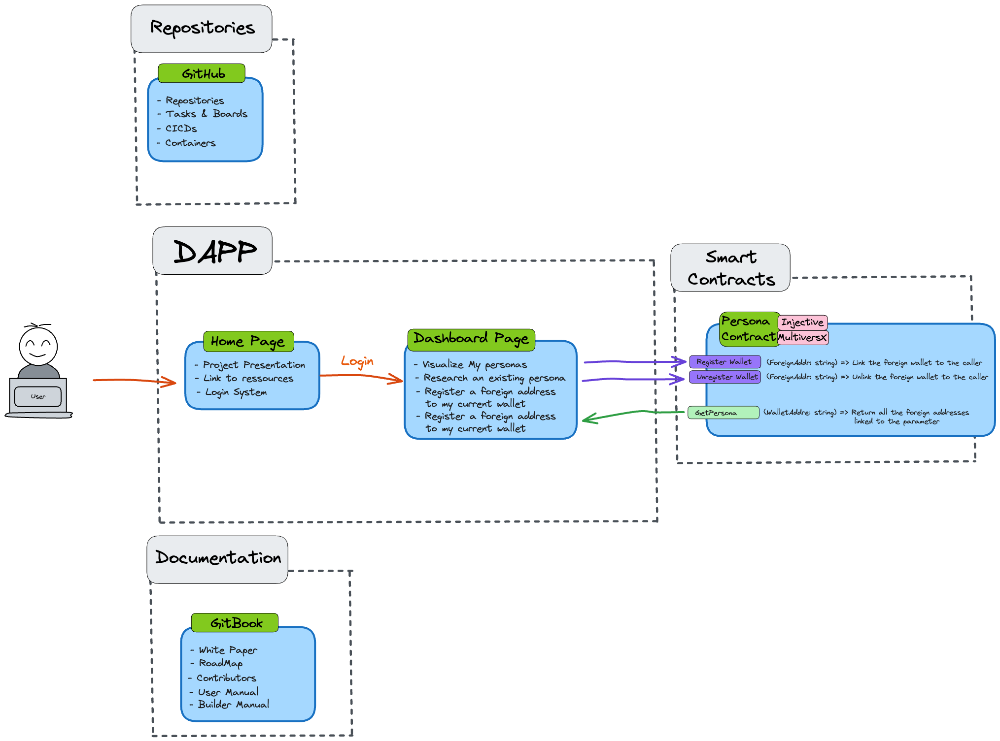

# Helios Collabathon

The Helios Collabathon is an open-source initiative aimed at bootstrapping a project from scratch with the power of community collaboration. The goal is to deliver a functional prototype by the end of the event. The project will remain open-source, enabling continued development and contributions even after the event concludes.

All project elements and resources will rely on public and open-source technologies. We aim to ensure that the project can be easily deployed and maintained, with clear and accessible documentation to attract and support future contributors.

## Project Overview

Version control and interoperability are crucial for the success of this project. We will prioritize the use of the most widely adopted and interoperable solutions for open-source projects to ensure seamless collaboration.

## Repositories

The project’s codebase will be hosted on GitHub, with separate repositories for each of the project’s components. This modular approach will allow for better organization and easier contribution management.

## Documentation

Comprehensive documentation will be hosted on GitBook, divided into sections corresponding to the different components of the project. This documentation will serve as a guide for contributors, detailing everything from setup to deployment.

## Deployed Application

The application will be deployed on a public server, with the deployment process fully documented and automated using GitHub Actions (CI/CD). This ensures that the project remains accessible and that updates can be deployed seamlessly.

## Objectives

	•	Community Collaboration: Foster a collaborative environment where participants can contribute to every aspect of the project.
	•	Rapid Prototyping: Develop a working prototype by the end of the event.
	•	Sustainability: Ensure the project is well-documented and easy to continue after the event, with clear pathways for new contributors.
	•	Open-Source Principles: Adhere to open-source standards and use interoperable technologies to maximize accessibility and future development.

Participants
 